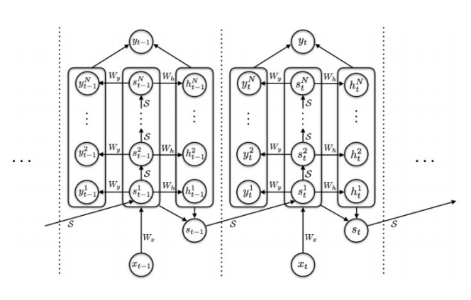
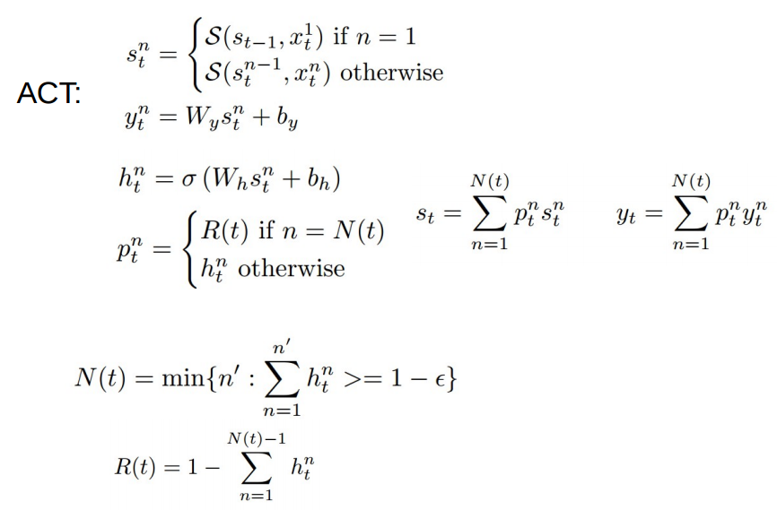

# Recurrent Neural Networks and its variants

## Adaptive Computation Time RNN

传统的RNN对于每一个输入都计算相同的次数，从直觉上来讲这样不一定是最好的，有些词语的表意很简单，有些词语的表意很丰富。

自适应计算时间的方法是希望通过结构的调整动态调整计算次数。本文是这么做的：

增加RNN的一个输出，当作概率，然后对每个输入，以此为依据决定是否要再计算一次；

本质上是对RNN的一个纵向扩展，将一个Cell 变成若干个Cell 叠加的状态。在传统的loss上增加了一项，最优化概率残差。

Tensorflow 开源实现：https://github.com/DeNeutoy/act-tensorflow

前辈评价：这是Google的人做的，ICLR 2017 open reviewer提及了这份工作；到目前为止，此论文一共有28个引用，从引用的质量看，至少有6篇(3篇ICLR和3篇NIPS)能得到认可。以上是靠谱的点，但是对比实验用的例子都比较奇怪（比如addition的例子，输入方式很奇怪），没有用常见任务和其他工作横评；网上能查到的关于此论文的资料，均只有对网络的介绍，没有效果反馈。

